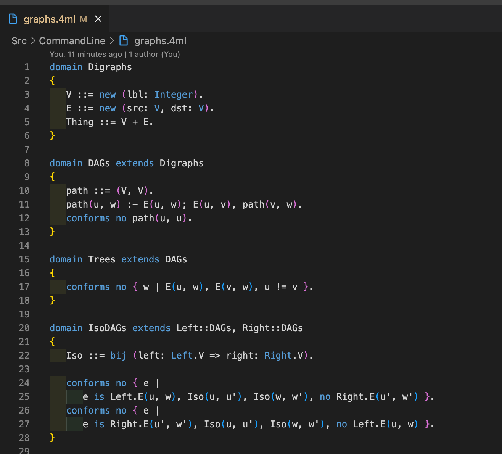

# formula 2.0 VSCode Language Support

[Formula 2.0](https://github.com/microsoft/formula) is a Formal Specifications language developed by Microsoft.

This package provides syntax highlighting for the language in vscode.

Example:

